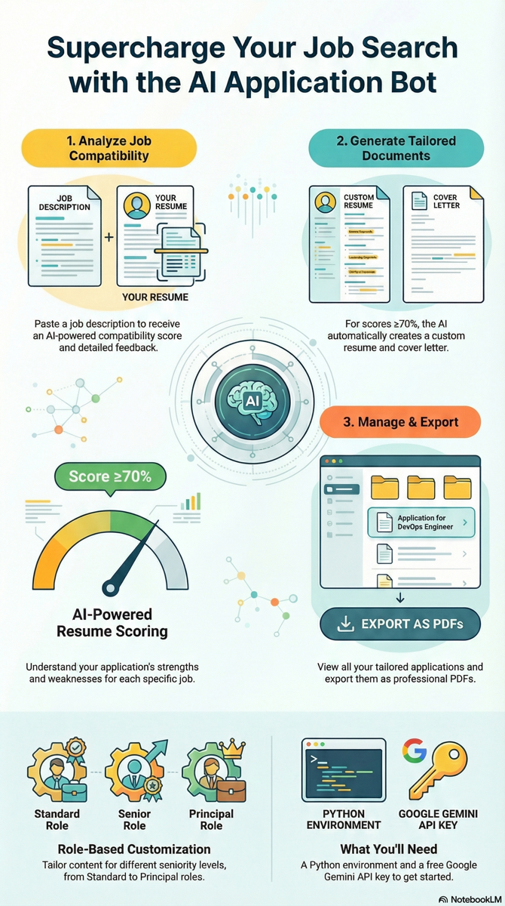

# CareerForge AI

Intelligent Resume Tailoring for IT/DevOps/AI Governance Roles

[Version: v2.3.0] [Python: 3.9+] [License: MIT]

---

## Overview

CareerForge AI is an intelligent tool that helps you tailor your resume for specific job applications using Google's Gemini AI. By analyzing the job description and your resume, it creates customized versions that align with the position requirements while preserving all factual information from your original resume.

Key Features:
- AI-powered resume compatibility scoring
- Intelligent resume and cover letter tailoring
- Job description storage for future reference
- Professional PDF export capability
- Role-based customization for different position levels
- Modern, themed UI with improved visual design
- Enhanced user experience with better layouts and styling
- Multiple export formats (PDF, Word, Plain Text, ATS-Optimized)
- Job import from external sources (LinkedIn, Email, Plain Text)
- Enhanced custom prompt management with template validation
- Built-in prompt examples and variable preview functionality
- Configurable minimum match threshold through GUI settings

---

## Quick Start

### Step 1: Install Dependencies
```bash
pip install -r requirements.txt
```

For PDF export functionality:
```bash
pip install reportlab
```

### Step 2: Configure API Key
```bash
cp .env.example .env
# Edit .env and add your GEMINI_API_KEY from https://makersuite.google.com/app/apikey
```

### Step 3: Launch Application
```bash
python gui/tkinter_app.py
```

---

## Visual Guides

### Application Interface

Main user interface of CareerForge AI showing the tabbed layout for job management, resume tailoring, and document export. The application features a modern UI with themed widgets and the new CareerForge AI icon.


### Workflow Diagram

Visual representation of the CareerForge AI workflow from job analysis to tailored application materials.



### Application Icons

CareerForge AI features custom icons for different platforms:


- **macOS**: `assets/CareerForge_AI.icns` - Native ICNS format for macOS
- **Windows**: `assets/CareerForge_AI.ico` - Native ICO format for Windows
- **Cross-platform**: `assets/CareerForge_AI.png` - PNG format for documentation and cross-platform use

These icons provide consistent branding across all supported platforms.

---

## How It Works

### 1. Analyze Job Compatibility
- Paste the job description (minimum 100 characters)
- Click "Analyze Match" to get your compatibility score
- Review detailed feedback on strengths and improvement areas

### 2. Tailor Your Application Materials
- For scores meeting or exceeding the configured threshold (default 80%), the "Start Tailoring" button becomes available
- AI generates a customized resume and cover letter
- All materials are automatically saved to the output folder

### 3. Import Jobs from External Sources
- Use the "Import Job" tab to import job descriptions from:
  - Plain text
  - LinkedIn job postings (HTML source)
  - Email content
- Automatically parses job titles, companies, and descriptions

### 4. Customize AI Prompts
- Use the "Custom Prompts" tab to create and manage custom prompt templates
- Load built-in examples as starting points for your custom prompts
- Preview how variables will be substituted in your prompts
- Save custom templates for specific roles or companies

### 5. Manage and Export Your Documents
- View previously tailored applications in the "Tailored Documents" tab
- Export your materials in multiple formats:
  - PDF (professional formatting)
  - Word (.docx)
  - Plain Text (.txt)
  - ATS-Optimized (for Applicant Tracking Systems)

---

## Configuration Options

### Minimum Match Threshold
Adjust the minimum compatibility score required to enable tailoring:

1. **Through the GUI (Recommended)**: Use the Settings tab to adjust the threshold with a slider or manual input
2. **Direct Code Modification**: Edit the value in `config/settings.py`:
```python
# In config/settings.py
MIN_MATCH_THRESHOLD = 70  # Default: 70%
```

**Threshold Guidelines**:
- 70-75%: Aggressive applications (lower match tolerance)
- 80%: Balanced approach (recommended default)
- 85-90%: Conservative applications (higher match requirements)

### Role Levels
Choose the appropriate role level for optimal tailoring:

1. **Standard**: Entry to mid-level positions (0-5 years)
2. **Senior**: Senior-level positions (5-10 years)
3. **Lead**: Lead positions (8-15 years)
4. **Principal**: Principal/architect positions (12+ years)

Select the level that best matches the position requirements.

---

## Building Standalone Executable

```bash
# Install PyInstaller
pip install pyinstaller

# Build cross-platform executable
python build_standalone.py
```

---

## Troubleshooting

Common issues and solutions:

- "API key not found": Ensure .env file contains your GEMINI_API_KEY
- "No active resume": Upload and set a resume as active in the Resume Management tab
- "Match analysis failed": Job description must be at least 100 characters

---

## License

MIT License - See LICENSE file for details